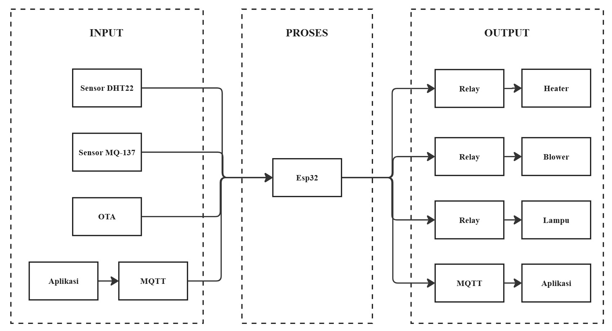

# 🐔 Smart Laying Hens Cage (Kandang Ayam Petelur Cerdas)

Sistem pemantauan dan pengkondisian lingkungan kandang ayam petelur berbasis Internet of Things (IoT). Proyek ini dirancang untuk menjaga produktivitas dan kesehatan ayam petelur dengan mengukur temperatur, kelembapan, serta kadar gas amonia secara *real-time*.

---

## 📌 Deskripsi Proyek

Kondisi lingkungan pada kandang ayam petelur sangat mempengaruhi tingkat stres dan produktivitas bertelur. Gas amonia yang berlebihan serta suhu/kelembapan yang tidak ideal dapat memicu penyakit respirasi pada ayam. 

**Smart Laying Hens Cage** hadir sebagai solusi berbasis IoT yang menggunakan mikrokontroler **ESP32** sebagai otak utama. Data sensor dikirimkan secara cepat dan hemat daya menggunakan protokol komunikasi **MQTT**, lalu ditampilkan pada dashboard interaktif berbasis web yang dibangun dengan **Node-RED**. Sistem ini juga dilengkapi fitur **Over-The-Air (OTA)** untuk pembaruan kode secara nirkabel tanpa perlu melepas perangkat dari kandang.

---

## 🚀 Fitur Utama

- **Monitoring Real-Time**: Memantau suhu, kelembapan, dan kadar gas amonia ($NH_3$) secara akurat.
- **Komunikasi Ringan & Cepat (MQTT)**: Menggunakan sistem *Publish-Subscribe* untuk transmisi data yang responsif.
- **Pembaruan Nirkabel (OTA - Over-The-Air)**: Memudahkan pemeliharaan perangkat lunak/firmware tanpa koneksi kabel fisik.
- **Dashboard Web Interaktif (Node-RED)**: Visualisasi data berupa grafik, gauge, dan kontrol sistem yang user-friendly.

---

## 🛠️ Komponen Hardware & Software

### Hardware
| Komponen | Fungsi / Peran |
| :--- | :--- |
| **ESP32** | Mikrokontroler utama & modul Wi-Fi/Bluetooth |
| **DHT22** | Sensor suhu dan kelembapan udara presisi tinggi |
| **MQ-137** | Sensor khusus untuk mendeteksi konsentrasi gas Amonia ($NH_3$) |
| **Ceramic Heater** | Elemen pemanas keramik untuk menjaga suhu kandang tetap hangat. |
| **Kipas Blower** | Kipas pembawa sirkulasi udara & pembuang amonia/panas berlebih. |
| **Relay Module** | Sakelar elektronik untuk mengontrol aktuator bertegangan tinggi. |
| **Power Supply** | Catu daya untuk ESP32 dan aktuator. |

### Software & Protokol
- **Arduino IDE / PlatformIO**: Environment pemrograman firmware ESP32.
- **MQTT Broker**: (Contoh: HiveMQ / Mosquitto / EMQX) sebagai perantara pesan, disini saya menggunakan HiveMQ.
- **Node-RED**: Platform pemrosesan data dan pembuat dashboard web.

---

## 🏗️ Arsitektur Sistem

## 🔌 Skema Pinout Singkat

| Sensor | Pin Sensor | Pin ESP32 |
| :--- | :--- | :--- |
| **DHT22** | VCC | 3.3V / 5V |
| | DATA | GPIO 4 |
| | GND | GND |
| **MQ-137** | VCC | 5V |
| | AOUT (Analog) | GPIO 34 (ADC) |
| | GND | GND |

---

## 🖥️ Integrasi Dashboard Node-RED

Dashboard Node-RED memvisualisasikan parameter kandang secara intuitif:
- **Gauge Suhu & Kelembapan**: Menampilkan status kenyamanan lingkungan ayam.
- **Gauge Gas Amonia (PPM)**: Memberikan indikasi tingkat kebersihan udara dari kotoran ayam.
- **Historical Chart**: Grafik riwayat data untuk analisis statistik periodik.

---

