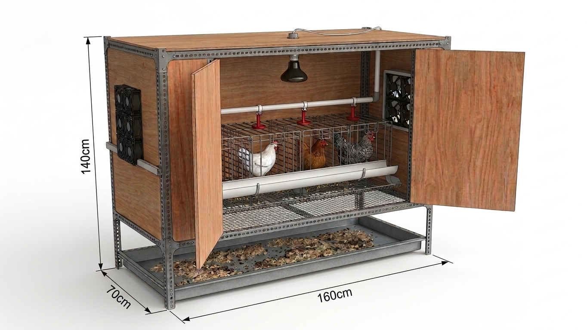
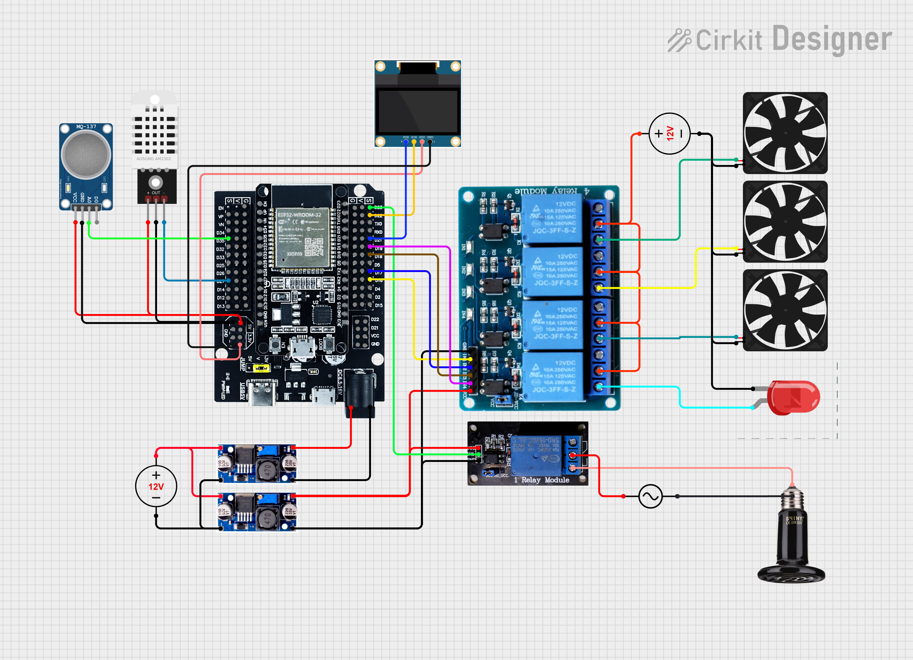
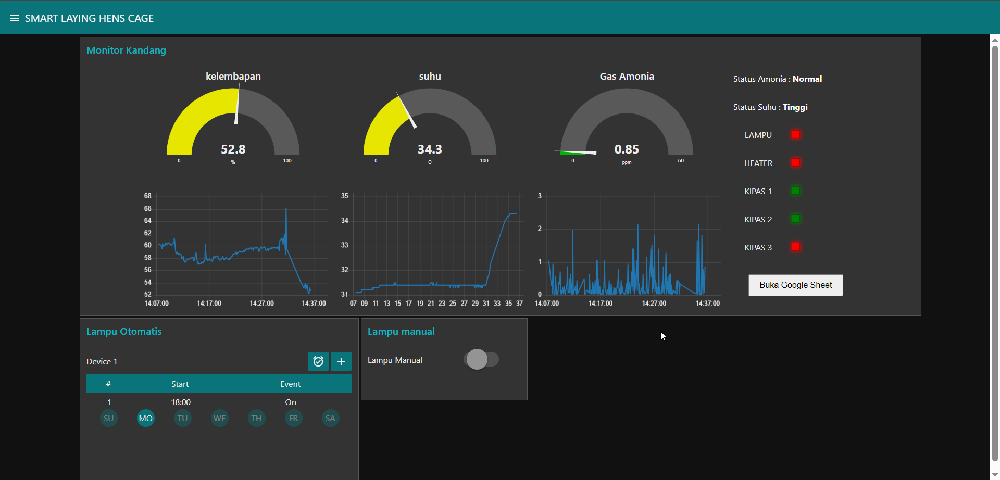

# 🐔 Smart Laying Hens Cage (Kandang Ayam Petelur Cerdas)

Sistem pemantauan dan pengkondisian lingkungan kandang ayam petelur berbasis Internet of Things (IoT). Proyek ini dirancang untuk menjaga produktivitas dan kesehatan ayam petelur dengan mengukur temperatur, kelembapan, serta kadar gas amonia secara *real-time*.

---

## 📌 Deskripsi Proyek

Kondisi lingkungan pada kandang ayam petelur sangat mempengaruhi tingkat stres dan produktivitas bertelur. Gas amonia yang berlebihan serta suhu/kelembapan yang tidak ideal dapat memicu penyakit respirasi pada ayam. 

**Smart Laying Hens Cage** hadir sebagai solusi berbasis IoT yang menggunakan mikrokontroler **ESP32** sebagai otak utama. Data sensor dikirimkan secara cepat dan hemat daya menggunakan protokol komunikasi **MQTT**, lalu ditampilkan pada dashboard interaktif berbasis web yang dibangun dengan **Node-RED**. Sistem ini juga dilengkapi fitur **Over-The-Air (OTA)** untuk pembaruan kode secara nirkabel tanpa perlu melepas perangkat dari kandang.

  

---

## 🚀 Fitur Utama

- **Monitoring Real-Time**: Memantau suhu, kelembapan, dan kadar gas amonia ($NH_3$) secara akurat.
- **Kontrol Lingkungan**: Mengontrol suhu, dan kadar gas amonia ($NH_3$) sesuai parameter yang telah ditentukan.
- **Komunikasi Ringan & Cepat (MQTT)**: Menggunakan sistem *Publish-Subscribe* untuk transmisi data yang responsif.
- **Pembaruan Nirkabel (OTA - Over-The-Air)**: Memudahkan pemeliharaan perangkat lunak/firmware tanpa koneksi kabel fisik.
- **Dashboard Web Interaktif (Node-RED)**: Visualisasi data berupa grafik, gauge, dan kontrol sistem yang user-friendly.

---

## 🛠️ Komponen Hardware & Software

### Hardware
| Komponen | Fungsi / Peran |
| :--- | :--- |
| **ESP32** | Mikrokontroler utama & modul Wi-Fi/Bluetooth |
| **DHT22** | Sensor suhu dan kelembapan udara presisi tinggi |
| **MQ-137** | Sensor khusus untuk mendeteksi konsentrasi gas Amonia ($NH_3$) |
| **Ceramic Heater** | Elemen pemanas keramik untuk menjaga suhu kandang tetap hangat. |
| **Kipas Blower** | Kipas pembawa sirkulasi udara & pembuang amonia/panas berlebih. |
| **Relay Module** | Sakelar elektronik untuk mengontrol aktuator bertegangan tinggi. |
| **Power Supply** | Catu daya untuk ESP32 dan aktuator. |

### Software & Protokol
- **Arduino IDE / PlatformIO**: Environment pemrograman firmware ESP32.
- **MQTT Broker**: (Contoh: HiveMQ / Mosquitto / EMQX) sebagai perantara pesan, disini saya menggunakan HiveMQ.
- **Node-RED**: Platform pemrosesan data dan pembuat dashboard web.

---

## 🏗️ Arsitektur Sistem

  

## 🔌 Skematik

  

---

## 🖥️ Antarmuka Dashboard Node-RED

Dashboard Node-RED menyediakan beberapa bagian kontrol dan monitoring visual:

1. **Parameter Lingkungan**:
   - *Gauge Suhu & Kelembapan*: Menampilkan nilai temperatur ($^\circ\text{C}$) dan $\%RH$.
   - *Gauge Amonia*: Menampilkan kadar amonia ($PPM$).
   - *Historical Chart*: Grafik tren data perubahan lingkungan secara berkala.
2. **Indikator Status Kondisi**:
   - *Status Suhu*: Indikator visual hijau/merah (*Normal / Tinggi*).
   - *Status Amonia*: Indikator visual (*Normal / Tinggi*).
3. **Monitor Status Aktuator**:
   - Status **Ceramic Heater** (ON / OFF).
   - Status **Kipas Blower** (ON / OFF).
   - Status **Lampu Kandang** (ON / OFF).
4. **Kendali Lampu Kandang**:
   - *Switch Manual Toggle*: Menyalakan atau mematikan lampu secara langsung dari aplikasi.
   - *Timer/Schedule Node*: Penjadwalan otomatis pencahayaan harian (misal: ON pukul 05.00 WIB, OFF pukul 21.00 WIB).

---

  

---

